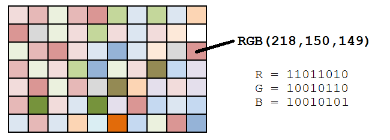

# noir
> I am a forest, and a night of dark trees: but he who is not afraid of my darkness, will find banks full of roses under my cypresses.
>
> (A flag submission note for hacking serenity: Please put the flag in standard format.)

  

Như mọi khi thì mình sẽ tiến hành kiểm tra ảnh qua các bước cơ bản như steghide, strings, binwalk, exiftool, ... Nhưng không ra thấy lại không nhìn thấy gì đặc biệt  

Dùng `https://stegonline.georgeom.net` để phân tích thì phát hiện  

  

Những hình vẽ mà ta nhìn thấy trên bức ảnh gốc được tạo chủ yếu bởi kênh Alpha

### Giải thích 1 xíu về RBGA  

Trong xử lý ảnh, mỗi pixel nói chung được lưu dưới dạng 8 bit hay 24 bit.  

Với biểu diễn 24 bit, mỗi pixel trải trên 3 byte, mỗi byte ứng với các màu đỏ, xanh da trời và xanh lá cây (RGB). Các màu mà ta nhìn thấy trên một bức ảnh là sự kết hợp của 3 màu trên.  

Mỗi byte có giá trị từ 0 - 255 ứng với cường độ màu. Màu tối nhất có giá trị 0, màu sáng nhất có giá trị 255.  

Đôi khi có một số ảnh sử dụng thêm 1 byte nữa để lưu giá trị Alpha dùng để quy định độ mờ, độ trong suốt của pixel

  

[Đọc thêm về RBG và LSB](https://whitehat.vn/threads/forensic-6-steganography.2409/)

### Quay lại challenge  

Dùng tool stego online, chỉ trích xuất giá trị của alpha mà lại thấy được bức ảnh nên suy ra được bức ảnh mà ta nhìn thấy chủ yếu được vẽ lên nhờ kênh Alpha.  

> At this point, there were two possibilities: either the R, G, B channels are just garbage and we only need to analyze the A channel or that the A channel contains no information other than the visual image itself and some information will be gained from the R, G and B channels. - https://hackmd.io/@r1t0/HywhSDkWj#

Ở đây thì ta sẽ có 2 trường hợp:
 - Một là những các dữ liệu trong R, G, B channels đều là dữ liệu rác, dữ liệu gây nhiễu và ta sẽ cần tập trung vào  channel A
 - Hai là dữ liệu trong channel A chỉ đơn giản là hình vẽ mà ta nhìn thấy, còn dữ liệu cần phải phân tích sẽ nằm trong channel R, G, B

Ta sẽ thử trường hợp 2 trước =))  

Ở đây là có thể sử dụng command `convert` để trích xuất dữ liệu của 3 kênh RGB như sau  

  

Hoặc có thể sử dụng Stego Online để trích xuất  

  

Cả 2 cách đều nhận diện dữ liệu là một file `webm`.Mở file lên thì nhận thấy đây là một chiếc video clip nhạc lofi  

  

Nghe sơ nhạc thì có vẻ không có gì đặc biệt lắm. Nếu để ý vào đoạn video clip thì sẽ thấy đèn xe nhấp nháy trong có vẻ giống Morse Code. Hmmmm...Vậy làm sao để có thể chuyển ánh đèn nhấp nháy đo thành Morse Code được??  

## Decode morse code from blinking light

### Cách 1: Viết script

Đầu tiên ta sẽ tiến hành cách clip ra thành các khung hình (frame) bằng câu lệnh sau  
```
mkdir frames
ffmpeg -i some.webm frames/out-%03d.jpg
```
  

Dùng lệnh `ls | wc -l` để đếm số file có trong folder này  


Vậy có tổng 1829 khung hình / ảnh ở đây

Sau đó ta sẽ tiến hành định vị vị trí của ánh đèn trong bức ảnh  

Sử dụng https://pixspy.com/ để định vị vị trí của pixel sáng đèn  


Ở đây mình chọn vị trí pixel là `(418,637)`

Ta có thể nhìn thấy giá trị RGB của các pixel này ở khung CLICK LOG ở phía bên trái  

Ta cũng có thể check lại các giá trị này bằng cách viết một đoạn script như sau:  

```py
#!/usr/bin/env python

from PIL import Image
import os
from tqdm import tqdm 

#framework tqdm will make your loops show a smart progress meter =))

coord = (418,637)

def get_pixel_val(filename):
	im = Image.open(filename)
	pix = im.load()
	ans = pix[coord]
	im.close()
	return ans

arr = []
for i in tqdm(range(1, 10)):
    idx = str(i)
    #format filename
    if len(idx) < 3:
        idx = "0"*(3-len(idx)) + idx #try to print(idx) after this line if you don't know what it do
    val = get_pixel_val(f"/home/cheese00/ctf/csawctf/frames/out-{idx}.jpg")
    print(val)
```

  

Ta có thể thấy kết quả được in ra màn hình của 10 ảnh đầu giống hệt với kết quả trên `pixspy`  

Qua phân tích cùng một pixel (418,637), với những ảnh sáng đèn channel R của pixel sẽ có giá trị từ 200 trở lên, và với những ảnh không sáng đèn thì channel R của pixel sẽ có giá trị từ 60 trở xuống  

Nên ta sẽ viết một đoạn script để có thể xác định xem bức ảnh đó là ảnh sáng đèn hay không sáng đèn.
- Nếu giá trị channel R của pixel lớn hơn 200 -> ảnh sáng đèn -> in ra `1`
- Nếu giá trị channel R của pixel nhỏ hơn 200 -> ảnh không sáng đèn -> in ra `0`

Vì kiểu dữ liệu của biến `val` là `<class 'tuple'>` nên nếu thêm [0] vào cuối dòng sau:

```py
val = get_pixel_val(f"/home/cheese00/ctf/csawctf/frames/out-{idx}.jpg")[0]
```
Ta sẽ lấy được giá trị của channel R 
> *Vì là kiến thức mới nên được note lại :3*

Và đây là đoạn script để biết được ảnh nào là ảnh sáng đèn và ảnh nào là ảnh không sáng đèn  

```py
if (val > 200):
	arr.append(str(1))
else:
	arr.append(str(0))
print(arr)
```
Kết quả


Nhận xét:
- Có 4 tấm ảnh sáng đèn liên tiếp nhau -> Đây có thể là 1 `dash`
- Có 2 tấm ảnh sáng đèn liên tiếp nhau -> Đây có thể là 1 `dot`
- Có 2 tấm ảnh không sáng đèn liên tiếp nhau -> Dùng để tách giữa các `dash` và `dot`
- Có 6 tấm ảnh không sáng đèn liên tiếp nhau -> Khoảng cách để thông báo đã hết một chữ cái  

Tiến hành code thêm một vài dòng nữa để có được đoạn morse code từ các bức ảnh
```py
cipher = "".join(arr)
cipher = cipher.replace("1111","-")
cipher = cipher.replace("11",".")
cipher = cipher.replace("000000"," ")
# loại bỏ các ảnh dư thừa
cipher = cipher.replace("00","")
cipher = cipher.replace("0","")
print(cipher)
```
Kết quả:


Tới đây thì ta có thể copy đoạn morse code để đem lên mạng decode  

Hoặc copy một script decode morse code bằng python ở trên mạng về dùng như này

```py
MORSE_CODE_DICT = { 'A':'.-', 'B':'-...',
                    'C':'-.-.', 'D':'-..', 'E':'.',
                    'F':'..-.', 'G':'--.', 'H':'....',
                    'I':'..', 'J':'.---', 'K':'-.-',
                    'L':'.-..', 'M':'--', 'N':'-.',
                    'O':'---', 'P':'.--.', 'Q':'--.-',
                    'R':'.-.', 'S':'...', 'T':'-',
                    'U':'..-', 'V':'...-', 'W':'.--',
                    'X':'-..-', 'Y':'-.--', 'Z':'--..',
                    '1':'.----', '2':'..---', '3':'...--',
                    '4':'....-', '5':'.....', '6':'-....',
                    '7':'--...', '8':'---..', '9':'----.',
                    '0':'-----', ', ':'--..--', '.':'.-.-.-',
                    '?':'..--..', '/':'-..-.', '-':'-....-',
                    '(':'-.--.', ')':'-.--.-', '_':'..--.-'}

def decrypt(message):
 
    # extra space added at the end to access the
    # last morse code
    message += ' '
 
    decipher = ''
    citext = ''
    for letter in message:
 
        # checks for space
        if (letter != ' '):
 
            # counter to keep track of space
            i = 0
 
            # storing morse code of a single character
            citext += letter
 
        # in case of space
        else:
            # if i = 1 that indicates a new character
            i += 1
 
            # if i = 2 that indicates a new word
            if i == 2 :
 
                 # adding space to separate words
                decipher += ' '
            else:
 
                # accessing the keys using their values (reverse of encryption)
                decipher += list(MORSE_CODE_DICT.keys())[list(MORSE_CODE_DICT
                .values()).index(citext)]
                citext = ''
 
    return decipher
```

Kết quả cuối cùng:


> *Đoạn script để decode cuối cùng sẽ được mình đính kèm trong folder*  

### Cách 2: Dùng tool có sẵn 

Sử dụng tool [MorseDecoder](https://github.com/Razer2015/MorseDecoder), để tool này record lại màn hình của ta, định vị chỗ nhấp nháy sáng đèn một cách chính xác. 

Sau một lát thì ta sẽ decode được flag  

  

Cả 2 cách đều không đưa ra flag chuẩn format, và cần phải chỉnh sửa lại một xí để có thể submit được  

### **Flag: flag{sil3nt_refl3ct1on}**