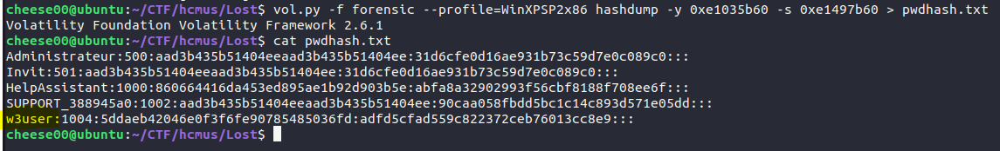

# LostInParis


## 1. Tìm mật khẩu Window

Tiến hành phân tích xem tập tin thuộc hệ điều hành nào

```
volatility -f forensic imageinfo
```


Sử dụng hệ điều hành được gợi ý là `WinXPSP2x86` để phân tích tiếp  

Tiếp theo, thông tin cần lấy tiếp theo là hive list. Hiểu đơn giản thì đây là công đoạn lấy ra trường địa chỉ bắt đầu trong bộ nhớ của nơi lưu trữ thông tin đăng ký và quản lý về tài khoản người dùng Windows  

```
vol.py -f forensic --profile=WinXPSP2x86 hivelist
```  


Trong kết quả hiện ra, có được danh sách các key về user trên Windows đang được lưu trữ trong data file. Công đoạn tiếp theo chỉ là tìm ra mã băm của mật khẩu trong mớ thông tin hỗn độn này thôi.  

Để làm được, phải biết được trường địa chỉ bắt đầu cho cả hai giá trị key của hệ thống [system key] và key của tập tin SAM [SAM key] (Windows lưu trữ chuỗi băm của mật khẩu người dùng trong tập tin SAM).

Trong các records trả về ở trên, ta quan sát có tổng cộng 3 cột:  

Virtual | Physical | Name  

Nhìn ở cột Name  thấy được system key là dòng
`\Device\HarddiskVolume1\WINDOWS\system32\config\system` và SAM key là `\Device\HarddiskVolume1\WINDOWS\system32\config\SAM`. Lấy ra giá trị Virtual tương ứng của 2 records trên và bỏ vào câu lệnh như bên dưới. Đồng thời,  sẽ trích xuất mã băm mật khẩu vào một tập tin text document để tiện quan sát.

```
vol.py -f forensic --profile=WinXPSP2x86 hashdump -y 0xe1035b60 -s 0xe1497b60 > pwdhash.txt
```



Như vậy, các tài khoản và hàm băm mật mã của tài khoản đó đã được liệt kê ra

Tập tin pwdump sẽ có format như sau:
```
<Username>:<User ID>:<LM hash>:<NT hash>:<Comment>:<Home Dir>:
```

Mật khẩu có thể sẽ được lưu theo dạng hàm băm LM hay NTLM. Theo như mình tìm hiểu thêm thì nếu  thấy ở trường LM hash kết thúc bằng “404ee” thì có nghĩa là nó không có hăm LM, nhưng có băm NTLM – vốn được Windows sử dụng.  

Trong bài này thì có LM hash và NTLM hash nên mình sẽ tiến hành băm cả 2 luôn.   

Sử dụng trang https://hashes.com/en/decrypt/hash để decrypt  

```
5ddaeb42046e0f3f6fe90785485036fd:IL0VEFORENSIC
adfd5cfad559c822372ceb76013cc8e9:IL0veForensic
```

Tới đoạn này thì mình không rõ lắm đâu mới là mật khẩu chính xác nên dùng cả 2 mật khẩu để submit  

Kết quả là mật khẩu `IL0veForensic` của NTLM là mật khẩu chính xác =))  

Hướng giải trên thì mình tham khảo dựa trên blog này: https://minhthuongeh.wordpress.com/2018/08/05/memory-dump-analysis-with-volatility-1/

## 2. Tìm mật khẩu Email

Sau khi dump linh tinh nhiều thứ thì mình phát hiện ra một cái gọi là `incredimail`


Sau đó thì mình tìm được link này https://xenarmor.com/how-to-recover-saved-email-passwords-in-incredimail/  

Theo như bài viết thì IncrediMail lưu tất cả mật khẩu đăng nhập email của người dùng trong registry theo đường dẫn sau

```
HKEY_CURRENT_USER\Software\Incredimail\Identities\*\Accounts_New
```

Và phần mềm `Email Password Recovery Pro` dựa trên thông tin trong đường dẫn này để lấy lại mật khẩu cho người dùng  

Nên hướng giải sẽ là dựng lại registry của đường dẫn trên trong data, import vào mấy Win, rồi dùng phần mềm để lấy mật khẩu  

Mình dùng plugin printkey trong volatality để mò đường dẫn trong registry: 

```
vol.py -f forensic --profile=WinXPSP2x86 printkey -K "Software\Incredimail\Identities"
```
Lưu ý là trong data sẽ tìm thấy key là `Accounts` chứ không phải `Accounts_New`  


Dựa vào các Key, Subkey và Value tìm thấy thì mình tiến hành dựng lại registry


Lưu ý là ở bước này thì đổi key `Accounts` thành `Accounts_New`

Dùng phần mềm để lấy mật khẩu mail 


**Mật khẩu mail: SnapshotIsReallyNiceForHacker**

## 3. Tìm mật khẩu twitter

Tiến hành liệt kê ra các tiến trình

```
vol.py -f forensic --profile=WinXPSP2x86 pslist
```


Thử bắt đầu dump từ wordpad trước

```
vol.py -f forensic --profile=WinXPSP2x86 memdump --dump-dir=./ -p 3212
```


Sau đó dùng strings và grep để lọc ký tự cần tìm là `twitter`

```
strings 3212.dmp | grep twitter | less
```


**Mật khẩu twitter: OverIsMyHero**

### Flag: HCMUS-CTF{IL0veForensic_SnapshotIsReallyNiceForHacker_OverIsMyHero}