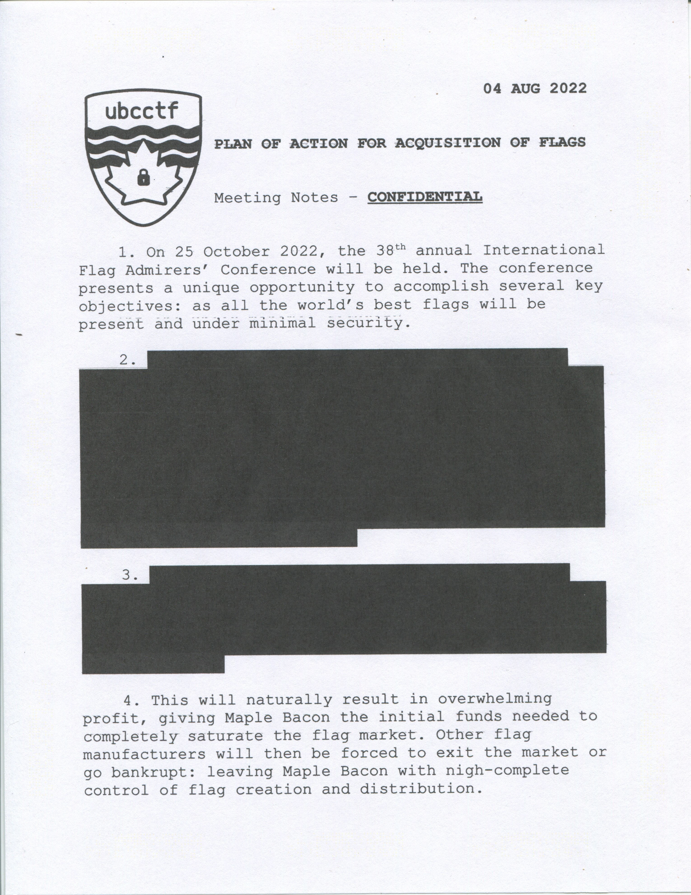

# Flag hoarding
> Damning internal communications within Maple Bacon have been leaked, revealing a plot to steal the flags of other teams at the upcoming International Flag Admirers' Conference. You've gotten a hold of the leaked files. Find information that could help uncover the identity of the whistleblower.

Ảnh đính kèm trong bài này như sau:


Ngay lúc nhìn đề bài thì mình nghĩ hướng giải là sẽ tìm cách đọc cái phần tô đen trong ảnh giống kiểu "redacted text in pdf"   

Sau một lúc tìm kiếm thì mình vẫn chưa tìm ra được cách nào để đọc phần màu đen đấy cả.  

Tuy nhiên, trong lúc sử dụng công cụ stego ảnh để cố gắng xem được phần bị tô đen thì mình lại tìm được những chấm này  


Có thể là một loại mã nào đó... Braille Code chăng?? 
  

Tuy nhiên, 1 ký tự trong Braille Code sẽ được tạo thành bởi bởi 6 chấm, nếu so với bản mã ở trên thì xếp kiểu gì cũng sẽ bị thừa một vài chấm hoặc thiếu một vài chấm. Nên có thể không phải là Braille Code  

Sau đó thì mình được cái này https://ctftime.org/writeup/30489  

Có thể nói là một challenge tương tự và những chấm trong bức ảnh kia chính là ["Machine Identification Code"](https://en.wikipedia.org/wiki/Machine_Identification_Code)  

Machine Identification Code (MIC) hay printer steganography, yellow dots, tracking dots là một hình mờ kỹ thuật số mà máy in laser màu và máy photocopy nhất định để lại trên mỗi trang in, cho phép xác định thiết bị được sử dụng để in tài liệu...

Và các hình mờ này cũng hoàn toàn có thể nhìn được bằng mắt thường =)) Nếu nhìn kỹ ta sẽ thấy được những chấm vàng trên nền trắng  

  

Trong writeup mình tìm thấy có chỉ cách sử dụng tool `deda` để decode MIC, tuy nhiên sau một hồi mày mò thì mình vẫn chưa hiểu cách dùng tool này lắm nên mình quyết định sẽ decode thủ công hơn một xí =)))

  

Dựa theo hình trên thì ta có thể tạm hiểu là từ đầu đoạn mã `row parity` đến `separator`dùng để biểu thị ngày tháng mà trang giấy được in  

Và sau cột `separator` là thông tin thêm về về trang giấy được in như số serial hoặc là flag :3  

Như hình trên thì thông decode ra được từ đoạn mã là những số vàng ở phía dưới  

Cách tính sẽ là chấm ở hàng thứ mấy thì cộng số đó vào tổng  

Ví dụ: Ở cột thứ 11 thì bắt đầu tính từ các chấm ở phía dưới dòng `col parity`  

Suy ra số màu tím sẽ là 32 + 16 + 8 + 1 = 57 (số màu vàng)  

Sau đó chỉ cần chuyền số này từ decimal sang ascii nữa là đọc được flag :))  

  

Ta có thể decode bằng tay như ảnh trên hoặc có thể code một đoạn script ngắn để việc decode nhanh hơn đỡ phức tạp hơn một xí như này  

```py
# Ghi lại mã theo từng cột, 1 là có chấm, 0 là không có chấm
arr = [
		"1101101","1100001","1110000","1101100","1100101",
		"1111011","1110100","1110111","0110000","1011111",
		"1000100","0110011","1000011","0110100","1000100",
		"0110011","0110101","1011111","0110000","1100110",
		"1011111","1110011","1110100","0110011","1100111",
		"0110000","1111101"
        ]
decode_arr=[]

for s in arr:
	value = 64
	total_value = 0
	for i in range (0,7):
		if(s[i] == "1"):
			total_value += value
		value /=2 
	decode_arr.append(chr(int(total_value)))

print("".join(decode_arr))
```

**Flag: maple{tw0_D3C4D35_0f_st3g0}**