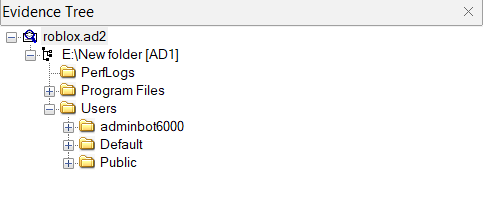
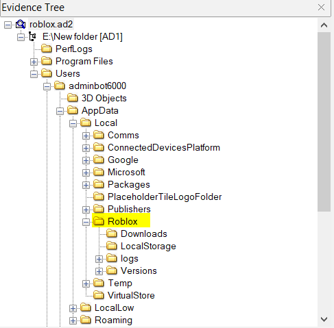
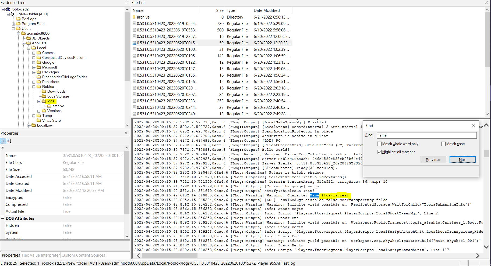

# Roblox_1.md
>The user of this PC has been accused for exploiting on Roblox. We need to find his username for further investigations. Find the username of the main Roblox account used on this system. The flag will be the format of vsctf{username}.

Bài này thật ra đề cho mình tới 2 file lận. Nhưng do không để ý tải về cái `ad1` thì bị lỗi, cái `ad2` thì mở được nên mình chỉ giải chall dựa trên mỗi cái `roblox.ad2` nên chỉ giải được mỗi chall `Roblox 1` =))

Dù sao thì, dựa trên file `roblox.ad2`, tiến hành bỏ vào FTKimage được cấu trúc thư mục như sau:



Ban đầu thì mình cũng mò đại trong này mở hết tất cả các file, folder có thể mở được. Trông cũng hơi bế tắc =))  

Lúc sau mình google thì có mò ra được cái folder của Roblox sẽ nằm ở 

```
C:\Users\(Your Windows Username)\AppData\Local
```



Lọ mọ thêm một hồi nữa thì mình tìm được thư mục `logs` có chứa các file ghi lại nhật ký hệ thống.  

Mở từng file lên rồi `Ctrl + F` tìm các keyword như là `user`, `username`, `name` thì thấy tên `ftcvisgreat` xuất hiện khá nhiều



Submit thử thì thành công =))

**Flag: vsCTF{ftcvisgreat}**
