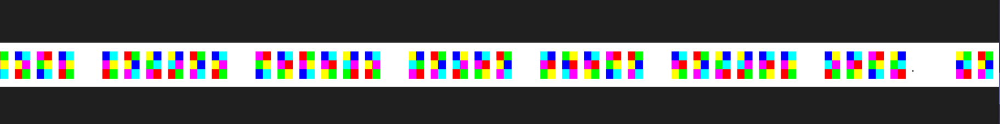
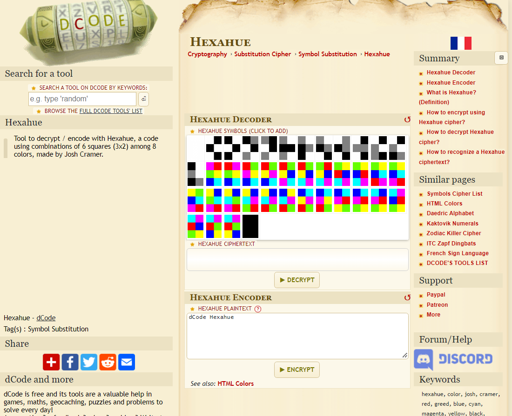
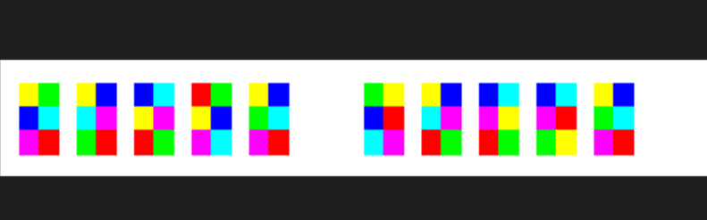
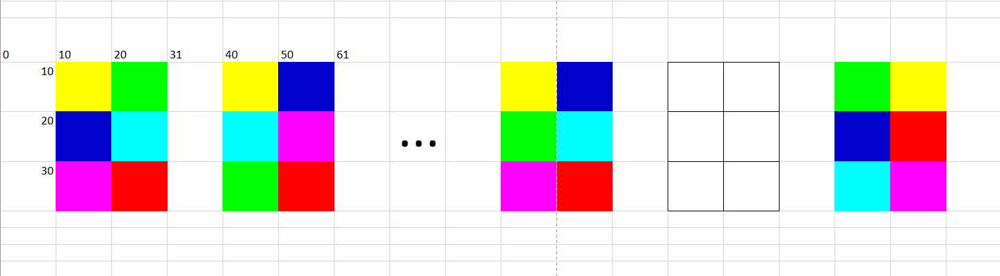
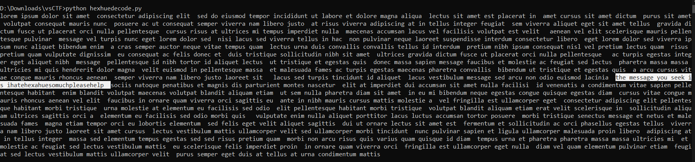

# Hexahue Hate!
> I hate hexahue so much!
>
>Note: Please wrap your answer in vsctf{}. Flag format (RegEx): vsctf\{[A-Z_]+\}

Đề cho ta một tấm ảnh như này



Nhưng dài ơi là dài...... =))

Dựa vào kinh nghiệm thì với những bài không biết làm gì thì ta nên google đề bài hoặc tên file 

Kết quả google thì đây là một dạng mã hóa và có tool giải mã online luôn https://www.dcode.fr/hexahue-cipher



Tuy nhiên là do Hexahue symbols mà ta có là dạng ảnh và nó cũng quá dài để mình có thể nhập tay lại từng symbol. Nên giải pháp lúc này là phải code thui :>  

May mắn là với keyword `hexhue ctf` thì mình đã tìm được một bài tương tự với một đoạn script decode luôn
https://masrt200.github.io/hacker-blog/houseplant-ctf

Mình có lấy về để chạy thử thì không decode được nguyên do là ảnh trong bài của `masrt200` là ảnh nhỏ. Tức là mỗi màu trong ảnh là 1 pixel. 6 pixel xếp thành hình chữ nhật là 1 symbol hexahue.  

Với chall của chúng ta thì sau khi code để kiểm tra nhiều lần thì mình có thể tóm tắt lại như sau:  



Mỗi một ô màu trong hình sẽ có độ dài khoảng 10 pixel 
Và với những chỗ có khoảng trống rộng thì ở đó cũng sẽ có một hexahue symbol, nhưng nó màu trắng



Để có thể sử dụng đoạn script của `masrt200` mình sẽ phải tự code một đoạn để xử lý hình ảnh, tạo ra một hình ảnh mới chuẩn hơn  

Chuẩn hơn nghĩa là mỗi màu chỉ được thể hiện bởi 1 pixel, và không có khoảng trắng giữa các symbol hexahue  

Ý tưởng cho đoạn code sẽ là:
- Một vòng lặp để duyệt qua từng cột
- Tại mỗi cột sẽ có một vòng lặp để duyệt qua từng hàng
- Bước cho mỗi lần lặp mình sẽ đặt là 10 để sao cho sau khi lấy được màu này xong thì ở lần lặp tiếp theo nó sẽ duyệt tới màu kế tiếp (cái này mọi người có thể chạy thử các đoạn code kiểm tra pixel của mình để dễ hình dung hơn)
- Nhìn theo hình trên thì thứ tự lấy màu sẽ là `vàng`, `xanh dương`, `hồng`, `xanh lá`, `xanh biển`, `đỏ` 
- Sau đó sẽ có một biến `check` để kiểm tra sau khi lấy màu được 2 cột, thì sẽ bỏ qua cột thứ 3, để bỏ qua phần màu trắng ở giữa các symbol hexahue
- Xử lý xong hình ảnh thì dùng đoạn script để decode là ra

```py
from PIL import Image

im=Image.open('hexhuebad.png')

'''
Code để kiểm tra các pixel của ảnh
'''

# check = 0
# for i in range (10,im.width,10):
# 	print("-------------------------")
# 	print("colum: " + str(i))
# 	if(check == 2):
# 		check = 0
# 		continue
# 	for j in range (10,31,10):	
# 		print("row: " + str(j))
# 		print(im.getpixel((i,j)))
# 		print(check)

# 	check += 1				
# 	if(i == 200):
# 		break

'''
Code kiểm tra khác
'''

# for i in range (130,im.width):
# 	print("colum: " + str(i))
# 	print(im.getpixel((i,10)))
# 	print('------------------')
# 	if(i == 230):
# 		break

'''
CODE để xử lý ảnh
'''
pixels=im.load() # hinh ban dau

im1=Image.new('RGB',(111340,3))
pixy=im1.load() # hinh moi

check = 0
x = 0 
y = 0 # y max = 2
for i in range (10,im.width,10):
	if(check == 2):
		check = 0
		continue
	for j in range (10,31,10):	
		pixy[x,y]=pixels[i,j]
		y += 1
		if(y>= 3):
			y = 0
	check += 1
	x += 1				

im1.save('better.png')

'''
CODE kiểm tra xem ảnh mới xử lý đúng chưa
'''

# im=Image.open('better.png')

# for i in range (0,im.width):
# 	print("-------------------------")
# 	print("colum: " + str(i))
# 	for j in range (0,im.height):
# 		print("row: " + str(j))
# 		print(im.getpixel((i,j)))


'''
CODE để decode ảnh đã xử lý
'''

colour={"B":(0,0,0),
"W":(255,255,255),
"G":(128,128,128),
"r":(255,0,0),
"g":(0,255,0),
"b":(0,0,255),
"y":(255,255,0),
"c":(0,255,255),
"m":(255,0,255)
}

a=[colour["m"],colour["r"],colour["g"],colour["y"],colour["b"],colour["c"]]
b=[colour["r"],colour["m"],colour["g"],colour["y"],colour["b"],colour["c"]]
c=[colour["r"],colour["g"],colour["m"],colour["y"],colour["b"],colour["c"]]
d=[colour["r"],colour["g"],colour["y"],colour["m"],colour["b"],colour["c"]]
e=[colour["r"],colour["g"],colour["y"],colour["b"],colour["m"],colour["c"]]
f=[colour["r"],colour["g"],colour["y"],colour["b"],colour["c"],colour["m"]]
g=[colour["g"],colour["r"],colour["y"],colour["b"],colour["c"],colour["m"]]
h=[colour["g"],colour["y"],colour["r"],colour["b"],colour["c"],colour["m"]]
i=[colour["g"],colour["y"],colour["b"],colour["r"],colour["c"],colour["m"]]
j=[colour["g"],colour["y"],colour["b"],colour["c"],colour["r"],colour["m"]]
k=[colour["g"],colour["y"],colour["b"],colour["c"],colour["m"],colour["r"]]
l=[colour["y"],colour["g"],colour["b"],colour["c"],colour["m"],colour["r"]]
m=[colour["y"],colour["b"],colour["g"],colour["c"],colour["m"],colour["r"]]
n=[colour["y"],colour["b"],colour["c"],colour["g"],colour["m"],colour["r"]]
o=[colour["y"],colour["b"],colour["c"],colour["m"],colour["g"],colour["r"]]
p=[colour["y"],colour["b"],colour["c"],colour["m"],colour["r"],colour["g"]]
q=[colour["b"],colour["y"],colour["c"],colour["m"],colour["r"],colour["g"]]
r=[colour["b"],colour["c"],colour["y"],colour["m"],colour["r"],colour["g"]]
s=[colour["b"],colour["c"],colour["m"],colour["y"],colour["r"],colour["g"]]
t=[colour["b"],colour["c"],colour["m"],colour["r"],colour["y"],colour["g"]]
u=[colour["b"],colour["c"],colour["m"],colour["r"],colour["g"],colour["y"]]
v=[colour["c"],colour["b"],colour["m"],colour["r"],colour["g"],colour["y"]]
w=[colour["c"],colour["m"],colour["b"],colour["r"],colour["g"],colour["y"]]
x=[colour["c"],colour["m"],colour["r"],colour["b"],colour["g"],colour["y"]]
y=[colour["c"],colour["m"],colour["r"],colour["g"],colour["b"],colour["y"]]
z=[colour["c"],colour["m"],colour["r"],colour["g"],colour["y"],colour["b"]]

A0=[colour["B"],colour["G"],colour["W"],colour["B"],colour["G"],colour["W"]]
A1=[colour["G"],colour["B"],colour["W"],colour["B"],colour["G"],colour["W"]]
A2=[colour["G"],colour["W"],colour["B"],colour["B"],colour["G"],colour["W"]]
A3=[colour["G"],colour["W"],colour["B"],colour["G"],colour["B"],colour["W"]]
A4=[colour["G"],colour["W"],colour["B"],colour["G"],colour["W"],colour["B"]]
A5=[colour["W"],colour["G"],colour["B"],colour["G"],colour["W"],colour["B"]]
A6=[colour["W"],colour["B"],colour["G"],colour["G"],colour["W"],colour["B"]]
A7=[colour["W"],colour["B"],colour["G"],colour["W"],colour["G"],colour["B"]]
A8=[colour["W"],colour["B"],colour["G"],colour["W"],colour["B"],colour["G"]]
A9=[colour["B"],colour["W"],colour["G"],colour["W"],colour["B"],colour["G"]]
space=[colour["W"],colour["W"],colour["W"],colour["W"],colour["W"],colour["W"]]
space2=[colour["B"],colour["B"],colour["B"],colour["B"],colour["B"],colour["B"]]
comma=[colour["W"],colour["B"],colour["B"],colour["W"],colour["W"],colour["B"]]
period=[colour["B"],colour["W"],colour["W"],colour["B"],colour["B"],colour["W"]]

letters={'a':a,'b':b,'c':c,'d':d,'e':e,'f':f,'g':g,'h':h,'i':i,'j':j,'k':k,'l':l,'m':m,'n':n,'o':o,'p':p,'q':q,'r':r,'s':s,'t':t,'u':u,'v':v,'w':w,'x':x,'y':y,'z':z,'0':A0,'1':A1,'2':A2,'3':A3,'4':A4,'5':A5,'6':A6,'7':A7,'8':A8,'9':A9,' ':space,',':comma,'.':period}


im=Image.open("better.png")
pixels=im.load()


#main code... 
hexhue=[]

for I in range(0,im.height,3):
	for J in range(0,im.width,2):
		partpix=[]
		for K in range(3):
			for L in range(2):
				partpix.append(pixels[J+L,I+K])

		hexhue.append(partpix)

#print(hexhue)
plaintext=''
for A in hexhue:
	for B in letters:
		if letters[B]==A:
			plaintext+=B

print(plaintext)
```

Kết quả sau khi chạy script:


**Flag: vsCTF{IHATEHEXAHUESOMUCHPLEASEHELP}**